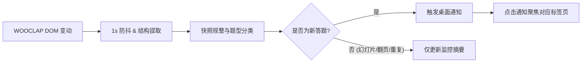

# NTULearn WOOCLAP Notifier

<p align="center">
  <strong>专为 NTU 课堂打造的轻量级 WOOCLAP 新题实时桌面通知扩展</strong>
  <br>
  A lightweight, privacy-first Chrome extension that alerts you when an open WOOCLAP session receives a new answerable question.
</p>

<p align="center">
  
  = 88">
  
</p>

---

## ✨ 核心特性

- 🔔 **新题即时通知**：当后台挂着的 WOOCLAP 页面出现老师发布的新题目时，立即弹出系统桌面通知。
- 🎯 **一键聚焦标签页**：点击桌面通知直接跳转并置顶对应的 WOOCLAP 课堂标签页与浏览器窗口。
- 🛡️ **严格隐私与零上传**：
  - 纯本地运行，不含任何统计、遥测或联网上传代码。
  - 不读取 Cookie、账号密码或 NTU Learn 后台 API。
  - **绝不自动答题**、不自动填写或提交任何答案。
- ⚡ **智能状态机识别**：
  - **基线过滤**：首次加载或刷新页面仅建立当前状态基线，绝不误触发通知。
  - **精准判定**：支持单选题、多选题、文本输入题、投票按钮组等多种交互题型。
  - **抗干扰过滤**：自动过滤普通讲义幻灯片、倒计时变化、翻页按钮（Next/Previous）及 Toast 临时提示。
- 📊 **实时监控面板**：点击扩展图标即可直观查看当前捕获的题目摘要、监测状态与通知诊断。

---

## 🛠️ 工作原理



---

## 🚀 快速安装

### 方式一：下载 Release 压缩包（推荐）

1. 前往项目的 **Releases** 页面，下载最新的 `ntulearn-wooclap-notifier-v*.zip` 并解压。
2. 在 Chrome 浏览器地址栏访问 `chrome://extensions/`。
3. 开启右上角的 **开发者模式 (Developer mode)**。
4. 点击左上角的 **加载已解压的扩展程序 (Load unpacked)**，选择解压后的文件夹。

### 方式二：从源码加载

```bash
git clone https://github.com/your-username/ntulearn-wooclap-notifier.git
cd ntulearn-wooclap-notifier
```

在 `chrome://extensions/` 中选择项目根目录加载即可。

> [!TIP]
> 建议在 Chrome 工具栏将 **NTULearn WOOCLAP Notifier** 图标固定（Pin），打开弹窗并点击 **“测试”** 按钮以确认系统通知权限正常。

---

## 📖 使用指南

1. **进入课堂**：在 NTU Learn (Blackboard) 中正常打开带有 WOOCLAP 的课程活动页面。
2. **保持开启**：保持 Chrome 及该 WOOCLAP 标签页处于打开状态（可在后台运行或最小化窗口）。
3. **接收提醒**：当教师切换至新题目时，系统将弹出“WOOCLAP 有新题目”通知。
4. **快速作答**：点击通知即可直接唤起并定位到作答页面。

> [!NOTE]
> 扩展弹窗中的“当前内容”摘要每秒自动刷新，若内容随讲义更新，说明后台监测处于正常活跃状态。

---

## ❓ 常见问题排查

### 1. 点击“测试”未收到桌面通知？
- **Chrome 权限**：检查 `chrome://settings/content/notifications`，确保允许 Chrome 发送通知。
- **Windows 系统通知**：检查 Windows **设置 -> 系统 -> 通知**，确保 Chrome 的通知权限已开启。
- **专注助手**：若 Windows 开启了“专注助手 / 勿扰模式 (Do Not Disturb)”，通知可能被静默收纳进系统通知中心。

### 2. 为什么刷新页面没有提示新题？
- 扩展设计了**基线初始化机制**（Baseline），每次刷新或刚进入页面时会先记录当前状态为初始基线，仅在后续检测到**新发布的题目**时才会通知，避免刚进课堂时受到重复打扰。

### 3. 支持哪些浏览器？
- 基于 **Manifest V3** 标准开发，完美支持 Chrome 88+、Microsoft Edge、Brave 等所有 Chromium 内核浏览器。

---

## 💻 本地开发与测试

本项目零第三方依赖，使用 Node.js 内置能力即可完成全部测试与打包：

```bash
# 运行全部 14 项自动化单元测试
npm test

# 语法与 Manifest 静态校验
npm run check

# 一键打包生成可发布的 ZIP 压缩包 (输出至 dist/)
npm run package
```
